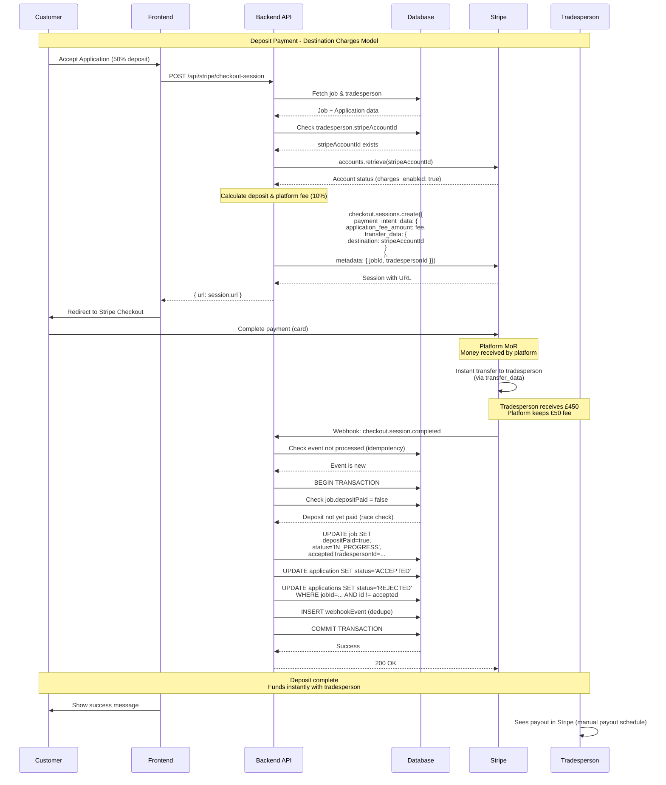
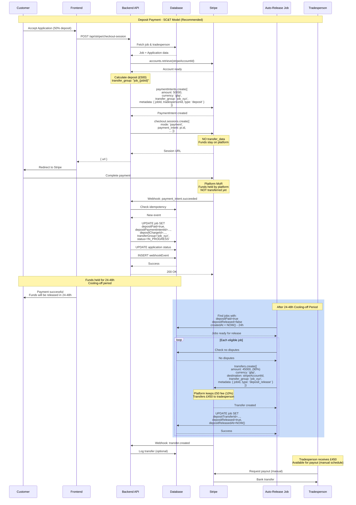
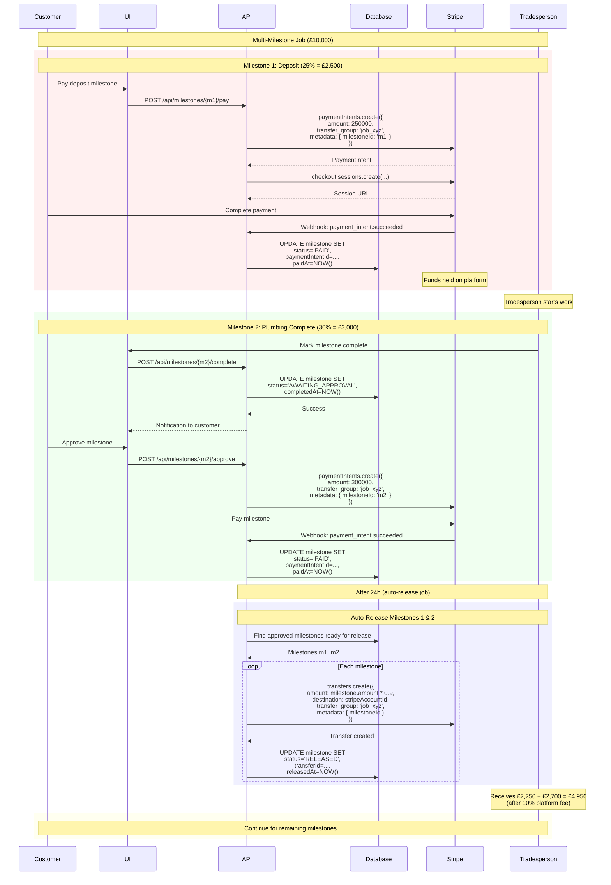
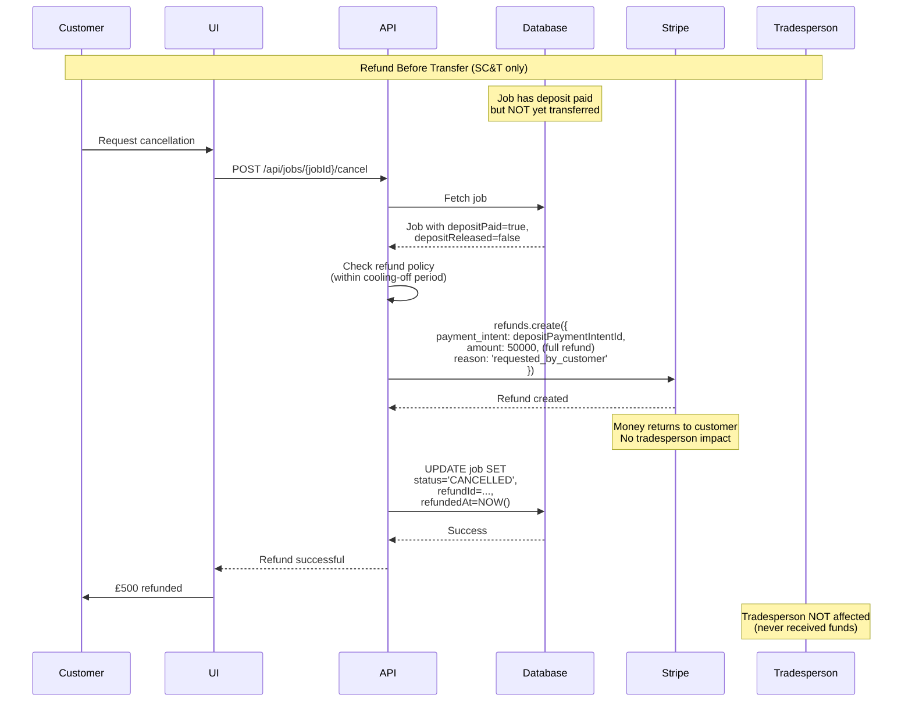
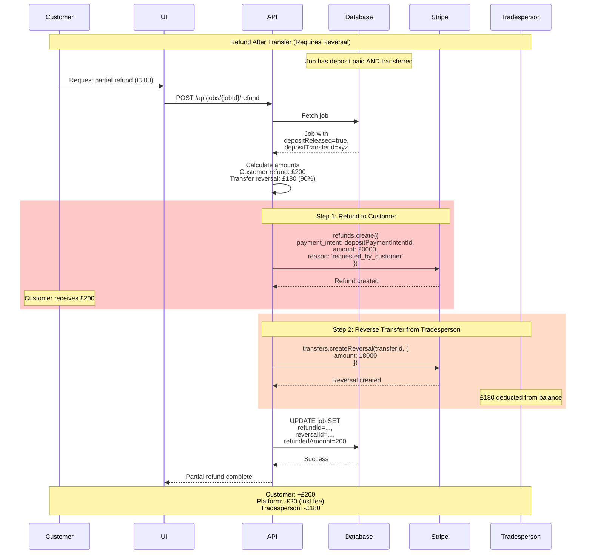
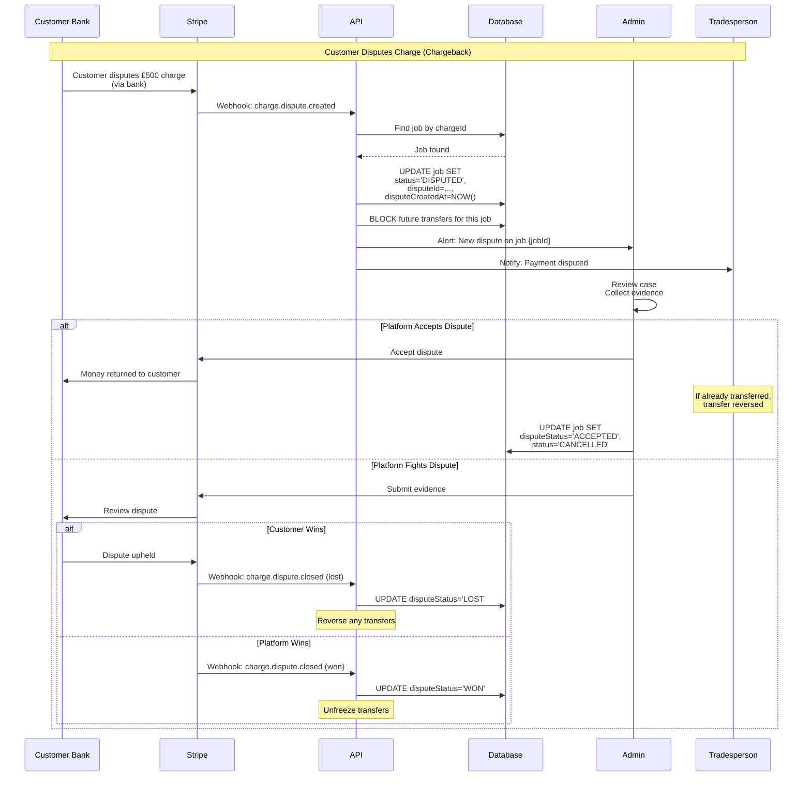
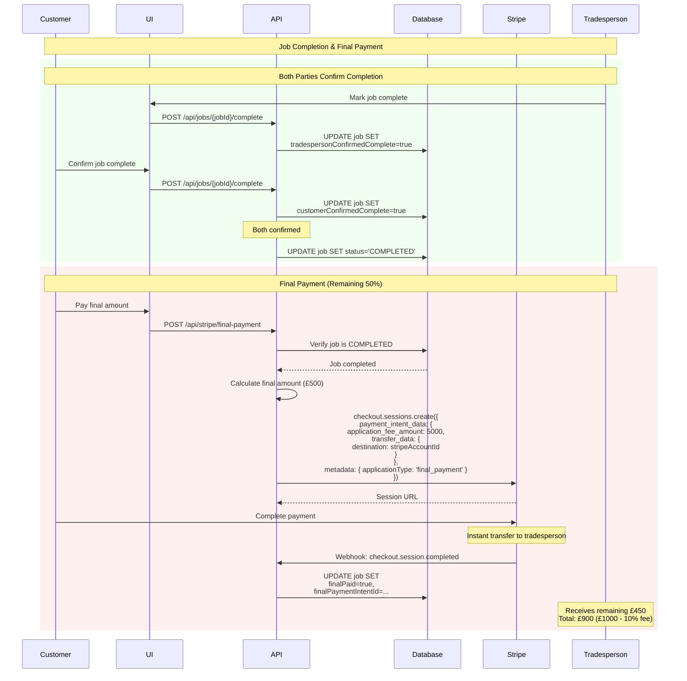
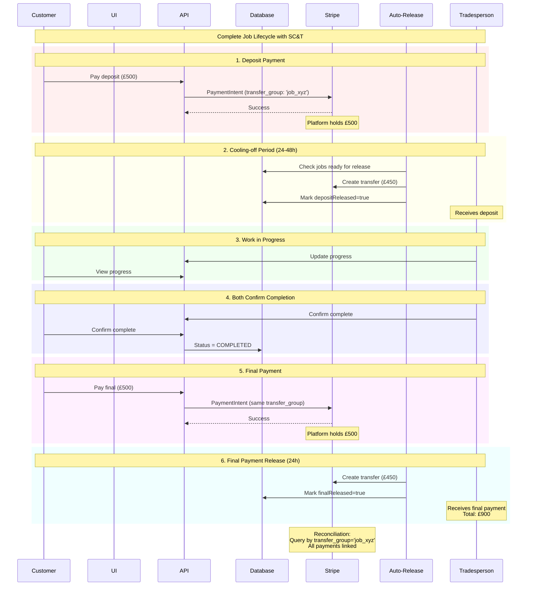

# Payment Flow Sequence Diagrams

This document contains Mermaid sequence diagrams for all payment flows in the Need A Tradesman marketplace.

---

## 1. Current Deposit Flow (Destination Charges)

**Status:** ✅ Currently Implemented

**Key Characteristics:**
- ✅ Instant transfer to tradesperson
- ✅ Application fee collected
- ✅ Webhook idempotency & race condition handling
- ❌ No cooling-off period
- ❌ No transfer_group
- ❌ Cannot conditionally release funds

---

## 2. Recommended Deposit Flow (SC&T)

**Status:** 🟡 Recommended Implementation

**Key Improvements:**
- ✅ 24-48h cooling-off period
- ✅ `transfer_group` links all payments
- ✅ Conditional fund release
- ✅ Can refund before transfer (no tradesperson impact)
- ✅ Better for disputes
- ✅ Supports milestones

---

## 3. Milestone Payment Flow (SC&T)

**Status:** 🔴 Not Implemented (Planned)

**Benefits:**
- ✅ Customer only pays for completed work
- ✅ Tradesperson gets paid progressively
- ✅ All linked by `transfer_group: "job_xyz"`
- ✅ Platform can reconcile entire job
- ✅ Each milestone has approval workflow

---

## 4. Refund Flow (Before Transfer)

**Status:** 🟡 Partial (needs SC&T)

---

## 5. Refund Flow (After Transfer)

**Status:** 🔴 Not Implemented

---

## 6. Dispute Flow

**Status:** 🔴 Not Implemented

---

## 7. Final Payment Flow (Current)

**Status:** ✅ Implemented (Destination Charges)

---

## 8. Complete Job Lifecycle (SC&T - Recommended)

**Status:** 🟡 Future State

---

## Summary Comparison

| Feature | Current (Destination) | Recommended (SC&T) |
|---------|----------------------|-------------------|
| **Payout Timing** | Instant | Controlled (24-48h) |
| **Cooling-off** | ❌ No | ✅ Yes |
| **Milestones** | ⚠️ Limited | ✅ Full support |
| **transfer_group** | ❌ No | ✅ Yes |
| **Refund (before)** | ⚠️ Affects tradesperson | ✅ No tradesperson impact |
| **Reconciliation** | ⚠️ Manual | ✅ Automatic via group |
| **Flexibility** | Low | High |
| **Complexity** | Low | Medium |

---

**Document Version:** 1.0  
**Last Updated:** 2025-10-19  
**Maintained By:** Engineering Team
